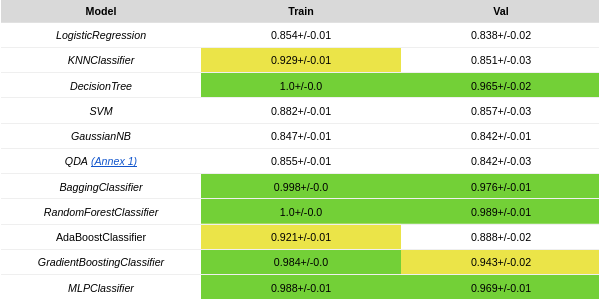
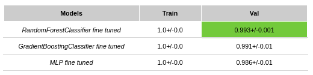
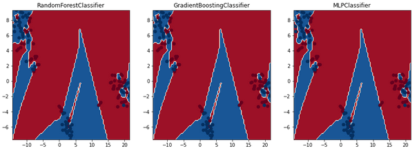
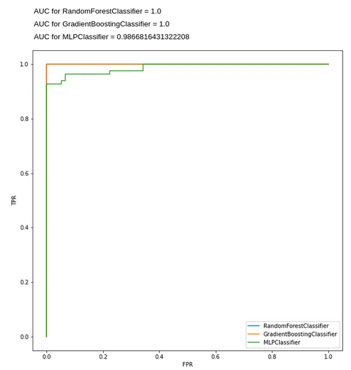
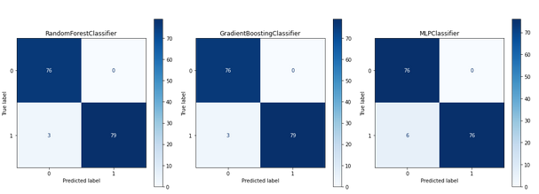

# smith-parasite-classification

# Introduction

The Smith Parasite, a newly discovered disease in England, has affected more than 5000 people without a clear connection between them. Common symptoms include fever and tiredness, but some infected individuals may be asymptomatic. Post-disease conditions such as loss of speech, confusion, chest pain, and shortness of breath have been associated with the virus. The mode of transmission is still unknown, and it is unclear which individuals will suffer from the disease. However, certain groups of people appear to be more susceptible to the parasite.

# Project Objective

The goal of this project is to build a predictive model that can determine which individuals are more likely to suffer from the Smith Parasite. A limited amount of sociodemographic, health, and behavioral information collected from the patients will be available for analysis and transformation as needed. The data science team will apply various models to answer the defined question with increased accuracy. The objective is to develop a model that can predict whether an individual will suffer from the Smith Disease. The performance of the model will be evaluated based on the percentage of instances correctly predicted, using the f1 score.

# Data

The data sets availabe for training (with the target *Disease*) are:
- train_demo.csv - the training set for demographic data and the target
- train_health.csv - the training set for health related data
- train_habits.csv - the training set for habits related data

The data about the patients whose target we want to predict:

- test_demo.csv - the test set for demographic data
- test_health.csv - the test set for health related data
- test_habits.csv - the test set for habits related data

# Development process

1. **Exploration**: Each data set is explored to better understand the data and find the potential best discriminatory features, as well as to understand if there were some inchoerences or other problems that need to be fixed.

2. **Preprocessing**: Problems such as outliers and incoherences are fixed. The data is scaled and the most discriminatory features are selected based on filter methods, wrapper methods and embedded methods.

3. **Model Selection**: A series of different models are compared against each other using Stratified K-Fold.

4. **Best Models and Tuning**: After comparing a lot os different models, the best three are selected and their hyperparameters are tuned to achieve the best performance.

5. **Assessment and Final Model Choice**: The best final model is choosen and used to predict the *test set* target.

Decision Boundaries

ROC Curve

Confusion Matrix

